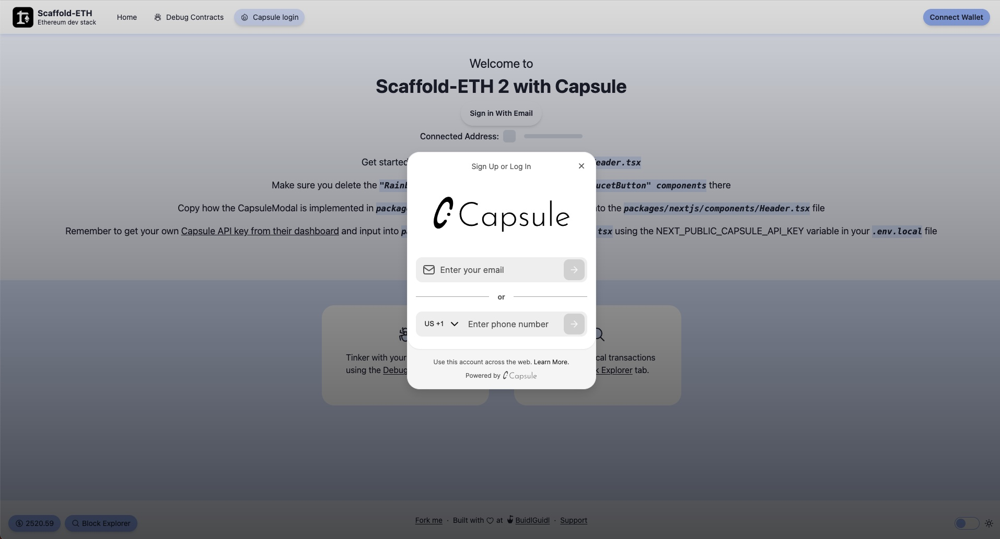

# Dynamic extension



This Scaffold-ETH 2 extension comes pre-configured with [Dynamic.xyz](https://dynamic.xyz/), providing an example to help you get started quickly. Follow the steps below to set up and start using the extension.

## Installation

1. Create a new project with Dynamic extension:

```bash
npx create-eth@latest -e @tantodefi/dynamic-extension
```

2. Configure environment variables:

Create the file `packages/nextjs/.env.local` and copy the contents of `packages/nextjs/.env.example` into it.

3. Get your Dynamic API Key:

Visit the Dynamic Dashboard  to get your Api Key: https://app.dynamic.xyz/ and add it to `packages/nextjs/.env.local`

> **Note:** Make sure to update the API key into the 'NEXT_PUBLIC_DYNAMIC_API_KEY' variable

## Documentation

For more detailed information and usage visit: https://docs.dynamic.xyz/introduction/welcome or watch this [youtube video](https://www.youtube.com/watch?v=72fHCCgUGmg)

## Notes

- make sure to follow the steps at the /dynamic-login page which is linked in the header
